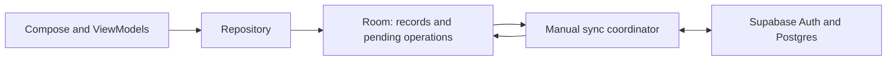

# Day 5: persistence with Supabase

Analysis date: 8 October 2026. Proposal only; no application, kanban-status or cloud changes were made by this review.

## Recommendation and scope decision

Use Supabase Postgres as the shared cloud database. Preserve Room on the Android device if Tala must still save and resume interviews without internet. That is the working recommendation because the existing Day 5 and release criteria explicitly require offline persistence.

The UI observes Room. A local transaction saves the edited data and its pending operation together. A successful server acknowledgement changes that operation's sync state. Local saves and cloud sync are separate outcomes. This follows Android's [offline-first repository guidance](https://developer.android.com/topic/architecture/data-layer/offline-first).

If internet-required operation is chosen instead, a Supabase-only repository is possible, but the original offline save/reboot acceptance criteria, Day 7 gate and release checklist must be revised. An in-memory cache does not satisfy durable offline saving.

## What exists and what is missing

| Area | Current implementation | Day 5 requirement |
| --- | --- | --- |
| Forms | Day 4 shared renderer and validation rules | Reuse through a persistence repository |
| Draft state | `FormSessionViewModel` holds maps in memory | Durable household/member answer storage |
| Repository | `HouseholdRepository` exposes read-only flows; demo implementation supplies fixtures | Transactional writes, reads, explicit errors and archive contracts |
| Identity | Typed string IDs, including `HH-00452` and `DEMO-SANTOS-1` | UUID record identities; retain household numbers as display codes |
| Models | Household/member records and scalar/multi answers | Persistence models for interviews, visits, coordinates and attachment references |
| Android dependencies | No Room, Supabase, Ktor or serialization setup | Pin compatible versions and compile a minimal integration |
| Networking | Manifest has no Internet permission | Add permission; replace the existing no-Internet-permission test with functional offline tests |
| Accounts/access | No authentication or server authorization | Auth session and database-enforced access before cloud access |
| Migrations/recovery | No persistent schema | Versioned schema, non-destructive migrations, rollback and restart tests |

Supabase MCP connectivity works. The two visible projects, ending `qvud` and `iwkz`, both report `INACTIVE`. Neither has been selected for Tala, and their schemas were not inspected. Select the intended project and restore/check it, or plan a dedicated project, before cloud implementation. Do not assume a blank database or modify an unrelated project.

## Proposed database design

Start with related records rather than one JSON document containing the entire registry:

| Records | Purpose |
| --- | --- |
| `households` | UUID, display code, owner/assignment, address, status, coordinates, archive marker |
| `members` | UUID, household relationship and structured identity fields |
| `interviews` | Household relationship, questionnaire version and interview lifecycle |
| `visits` | Interview relationship, visit outcomes and callback details |
| `household_answers` | Interview + section + field identity and typed answer value |
| `member_answers` | Interview + member + section + field identity and typed answer value |
| `attachments` | Record/scope relationship, local file reference and future private object path |
| Local `outbox` | Operation UUID, payload/version, retry state and owner; committed with the edit |

Separate answer tables make household/member scope constraints explicit and avoid nullable-member uniqueness mistakes. Enforce that each member belongs to the interview's household. Use unique answer keys, foreign keys and indexes for household, member and access-policy lookups. Keep answer payloads explicitly typed; JSONB is reasonable for scalar/multi payloads, with validation, while relationships and access fields remain relational.

Generate stable UUIDs before upload so retries keep the same identity. Preserve display codes separately and migrate fixtures deliberately. Store server revision numbers for conflict checks and timestamps for history; do not rely only on device clocks. Keep archive/deletion markers so synchronization cannot recreate deleted records accidentally.

A section save must persist the changed answer and all conditionally cleared answers atomically. An incomplete but validly structured draft must be saveable: required-field validation for completing an interview is different from the ability to save a draft.

## Supabase integration requirements

1. Inspect the selected project's schema and migration history; preserve any existing data. Check relevant platform updates after restoring the currently inactive project.
2. Commit reproducible SQL migrations with constraints, indexes, grants and RLS. Establish the matching Room schema and export it for migration tests.
3. Use Supabase Auth for identifiable test enumerators. For the first slice, propose owner-only access; confirm whether shared barangay assignments or supervisor access are required before expanding policies. Child records must inherit the same household access restrictions. Test two separate users.
4. Configure only the project URL and publishable key in the Android client. Never include a database password, secret key or service-role key. A publishable key identifies the app; the user session and RLS determine access. See [API keys](https://supabase.com/docs/guides/getting-started/api-keys) and [RLS](https://supabase.com/docs/guides/database/postgres/row-level-security).
5. Add the Supabase Kotlin Auth/PostgREST modules, a compatible Ktor engine and Kotlin serialization. The current app's minimum SDK 26 matches the documented minimum. Verify compatibility with the pinned Kotlin/toolchain rather than upgrading dependencies indiscriminately. See [Kotlin installation](https://supabase.com/docs/reference/kotlin/installing).
6. For a save affecting multiple server tables, define a transactional database function/RPC with caller authorization and explicit grants. Separate HTTP inserts do not form one transaction. Prefer invoker permissions. See [database functions](https://supabase.com/docs/guides/database/functions).
7. Implement one manual sync path first. Persist pending operations, retry with the same operation identity, and reject stale revisions visibly. Handle the case where the server committed but the acknowledgement was lost. Realtime notifications alone do not implement this queue or conflict policy.
8. Keep local drafts partitioned by account. Expired sessions should pause cloud sync without deleting unsent work; logout/account switching must not expose another enumerator's local records.

Photos/signatures stay in later cards. Day 5 records attachment references and documents app-private file retention, cleanup and backup. Future uploads should use private Storage access. Document recovery for both local unsynced data and cloud data; cloud persistence alone does not protect edits that never reached the server.

## Suggested work packages

The existing card allocates six hours and explicitly postpones cloud accounts/sync. Supabase expands that scope. Split the work and re-estimate after the project and offline decisions:

- **D05A — Durable local storage:** UUID mapping, entities/DAOs, transactional repository, schema export/migration test, and one saved household with two members surviving process death and reboot.
- **D05B — Secure cloud storage:** selected active Supabase project, SQL migrations, Auth/RLS, pinned Kotlin client, and an authenticated read/write proof with two-user isolation tests.
- **D05C — Manual synchronization:** atomic local outbox, server transactional save, retry/idempotency, revision conflict handling and a phone-to-server-to-phone round trip.

Keep full household/member editing in Day 6, using these repositories. Background scheduling, collaborative editing, a supervisor portal and full photo sync should be separately estimated. Update `planning/build-board.cjs` first when the revised scope is agreed; it generates the Markdown plan and HTML board.

## Acceptance evidence required

- Save fictional household data and two members; force-stop and reboot; reload the exact records and scoped answers.
- Disable connectivity and repeat local save/resume. A failed upload remains visibly pending, with the draft intact.
- Inject a local transaction failure: no partial household/member/answer changes and no false Saved state.
- Inject a server transaction failure: no partially written aggregate.
- Save a conditional branch, hide it, and reopen the record: cleared answers stay cleared on device and server.
- Retry an acknowledged or ambiguously acknowledged operation: no duplicate household/member/answer records.
- Read synchronized data through a fresh authenticated client and compare it with the local record.
- User B cannot read or modify User A's records, including by using a known record UUID or moving a child record between households.
- A stale server revision produces a conflict instead of silently overwriting a newer edit.
- A database upgrade preserves existing records; destructive migration is not used.
- Record APK version/hash, database schema/migrations, device results and known limits. Refresh the existing JVM/Compose regression checks after integration.

Pending decisions: offline saving versus internet-required operation; target Supabase project; initial enumerator ownership/assignment rules. The recommended first slice assumes offline saving and individual owner-only test accounts.
