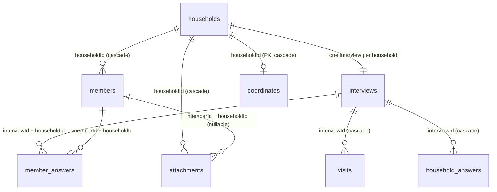

# D05 — Room database and durable storage

Implemented and verified on 8 October 2026. Day 5's storage acceptance is complete on OPPO CPH2529, Android 15 / API 35, using app version 0.3.0 (versionCode 3).

## Delivered

- Room 2.8.5 with KSP pinned in `gradle/libs.versions.toml`; schema export to `android-native/app/schemas/`, which the Room plugin also copies into androidTest assets.
- Eight entities with stable UUID identities, foreign keys and uniqueness constraints: `households`, `members`, `interviews`, `visits`, `household_answers`, `member_answers`, `coordinates`, `attachments`.
- `RegistryDao` (observable list, per-record reads, scoped clears) and `RegistryDatabase` (version 1, `exportSchema = true`, **no** destructive migration fallback).
- `RoomRecordStore`: validates a whole `StoredRecord`, writes it in one `withTransaction` block, and reports `WriteResult.Saved` or `WriteResult.Failed`. Replacement is full-snapshot, so cleared or hidden answers and removed members are deleted in the same transaction that saves the rest. `AnswerCodec` round-trips scalar and multi-select answers through JSON.
- Device tests covering reopen, per-member answer scoping, cleared-answer replacement, transaction rollback, failed-write reporting, schema/migration validation and force-stop/reboot recovery.

The Day 5 Supabase review is recorded separately in [the Day 5 Supabase analysis](../D05-SUPABASE-ANALYSIS.md). It recommends keeping Room for offline saving and splitting any cloud work into its own cards; no cloud code runs in the app.

## ERD



## Data dictionary

| Table | Primary key | Other columns | Purpose |
| --- | --- | --- | --- |
| `households` | `id` (UUID) | `displayCode` (unique), `headName`, `address`, `status` | One registered household; `displayCode` keeps the human-readable `HH-00452`-style number |
| `members` | `id` (UUID) | `householdId` (FK) | Household members; composite index on `(id, householdId)` |
| `interviews` | `id` (UUID) | `householdId` (FK, unique), `questionnaireVersion` | Interview lifecycle holder for one household |
| `visits` | `id` (UUID) | `interviewId` (FK), `outcome`, `callbackAt` | Callback/visit records |
| `household_answers` | `(interviewId, section, field)` | `kind`, `value` | Typed answers for household-scoped sections |
| `member_answers` | `(interviewId, memberId, section, field)` | `householdId` (FK), `kind`, `value` | Typed answers scoped to exactly one member |
| `coordinates` | `householdId` | `latitude`, `longitude`, `accuracyMetres`, `capturedAt` | One optional fix per household |
| `attachments` | `id` (UUID) | `householdId` (FK), `memberId?` (FK), `kind`, `relativePath`, `mimeType` | References to files kept outside the database |

Answers are stored as `kind` + `value`: `scalar` holds a JSON-quoted string, `multi` holds a JSON array. Decoding is validated before every write, so an unreadable answer can never reach the database.

## App-private attachment strategy

- Files belong under the app's private `filesDir/attachments/<uuid>.<ext>`; the row stores only `attachments/<uuid>.<ext>` plus MIME type and scope.
- `RoomRecordStore` rejects any path that does not match `attachments/[a-zA-Z0-9_-]+\.[a-zA-Z0-9]+`, so traversal such as `../../databases/...` fails before the transaction opens.
- A household snapshot save deletes that household's attachment rows and re-inserts the current set in one transaction; file deletion hooks run when photo/signature capture is implemented in a later card.
- Photo and signature capture are **not** part of Day 5. Future cloud uploads should use private Storage objects, never public buckets.

## Backup and recovery policy

- The manifest sets `android:allowBackup="false"` and `android:fullBackupContent="false"`, and `res/xml/data_extraction_rules.xml` excludes the app root for both cloud backup and device transfer. Android never copies the database or files automatically.
- Storage is app-private (`/data/data/ph.tala.registry/databases/`), so other applications cannot read it; the trade-off is that **uninstalling the app deletes the data**.
- Upgrades preserve records: the database is version 1 with no migration yet, and no destructive migration is configured, so an unexpected schema version fails the open instead of wiping rows. `SchemaMigrationTest` keeps the exported JSON rebuildable and validated so the first real migration has a tested baseline.
- Durable user-facing recovery is the planned versioned JSON export/restore card, not Android auto-backup. Cloud sync, if approved, must keep an outbox and never be the only copy (see the Supabase analysis).
- Small key/value settings do not exist yet; when they do, they go to DataStore rather than Room. No DataStore dependency was added today because nothing needs one.


## Defects found and fixed during the day

1. **Serialization version skew.** `MigrationTestHelper` failed with `AbstractMethodError … typeParametersSerializers()` while decoding the exported schema: androidx.lifecycle resolves `kotlinx-serialization-core` to 1.7.3 while Room 2.8.5 resolves `kotlinx-serialization-json` to 1.8.1. Both are now pinned to 1.8.1 in the version catalog.
2. **Shared test database name.** The store suite deleted the same file the durability test seeds, so an evidence run wiped the seed. The suites now use `tala-registry-store-test.db` and `tala-registry-evidence.db`.
3. **One post-reboot flake.** The first UI regression immediately after reboot failed `errorsScrollAndFocusFirstInvalidFieldIncludingNumericLimits` (`field-hours` not displayed) during cold start. The form suite passed on re-run and the full suite passed clean afterwards; no code change was made for it.

## Acceptance checks

| Check | Result | Evidence |
| --- | --- | --- |
| Debug and instrumentation APKs | Built and installed; version 0.3.0 (3) | `android-native/app/build/outputs/apk/` |
| JVM regression | 18 passed: 11 form rules + 3 scoped form state + 4 shell | [FormRulesTest](day05/TEST-ph.tala.registry.domain.form.FormRulesTest.xml), [FormSessionViewModelTest](day05/TEST-ph.tala.registry.ui.FormSessionViewModelTest.xml), [ShellViewModelTest](day05/TEST-ph.tala.registry.ui.ShellViewModelTest.xml) |
| Room storage spike on device | 6 passed: reopen, member scoping, cleared-answer replacement, rollback, failed-write reporting, codec | [room-store-tests.txt](day05/room-store-tests.txt) |
| Schema export and migration harness | 1 passed: exported v1 schema rebuilt, validated, then opened by Room with the row intact | [schema-migration-test.txt](day05/schema-migration-test.txt) |
| Seed a saved record | 1 passed; database file 131072 bytes written at 10:44 | [durable-save-seed.txt](day05/durable-save-seed.txt) |
| Survive force-stop | 1 passed after `am force-stop` | [durable-save-after-force-stop.txt](day05/durable-save-after-force-stop.txt) |
| Survive reboot | 1 passed after `adb reboot` with `sys.boot_completed=1`; same file listed afterwards | [durable-save-after-reboot.txt](day05/durable-save-after-reboot.txt), [database-file.txt](day05/database-file.txt) |
| Failed transaction rolls back and reports failure | Passed: constraint failure after the household update returns `Failed` and the previous snapshot reloads unchanged; rejected writes return a message with no paths or SQL | [room-store-tests.txt](day05/room-store-tests.txt) |
| UI regression | 8 passed: 3 shell + 5 form, 47.021 seconds | [device-tests.txt](day05/device-tests.txt), [form-tests-rerun.txt](day05/form-tests-rerun.txt) |
| Android lint | 0 errors; 10 warnings, all dependency/tool version notices | [lint-results.txt](day05/lint-results.txt) |
| Kanban regression | Passed: 30 cards, dependency/Done gates, WIP, persistence, export/import, date shift, sprint filter, mobile widths, no script errors | `rtk proxy node planning/verify-board.cjs` |

Debug APK SHA-256: `b8a96172b75987092d0628dc8464e4991186860c4b1384820194a1eddadb1da0`.

## Run

From `android-native`:

```powershell
rtk proxy ./gradlew.bat :app:assembleDebug :app:testDebugUnitTest :app:lintDebug :app:assembleDebugAndroidTest
adb install -r app\build\outputs\apk\debug\app-debug.apk
adb install -r app\build\outputs\apk\androidTest\debug\app-debug-androidTest.apk
adb shell am instrument -w -r -e class ph.tala.registry.data.local.RecordStoreDeviceTest ph.tala.registry.test/androidx.test.runner.AndroidJUnitRunner
adb shell am instrument -w -r -e class ph.tala.registry.data.local.SchemaMigrationTest ph.tala.registry.test/androidx.test.runner.AndroidJUnitRunner
adb shell am instrument -w -r -e class ph.tala.registry.data.local.DurableSaveTest#test1_seedSavedRecord ph.tala.registry.test/androidx.test.runner.AndroidJUnitRunner
adb shell am force-stop ph.tala.registry
adb shell am instrument -w -r -e class ph.tala.registry.data.local.DurableSaveTest#test2_savedRecordSurvivesProcessRestartAndReboot ph.tala.registry.test/androidx.test.runner.AndroidJUnitRunner
adb reboot
adb shell am instrument -w -r -e class ph.tala.registry.data.local.DurableSaveTest#test2_savedRecordSurvivesProcessRestartAndReboot ph.tala.registry.test/androidx.test.runner.AndroidJUnitRunner
adb shell run-as ph.tala.registry ls -l databases/
adb shell am instrument -w -r -e class ph.tala.registry.ui.ShellDeviceTest,ph.tala.registry.ui.FormDeviceTest ph.tala.registry.test/androidx.test.runner.AndroidJUnitRunner
```

Run `DurableSaveTest` in that order: `test1` seeds and deletes any previous evidence file, `test2` must run in a fresh process after the force-stop and again after the reboot. The two classes must not run concurrently; parallel instrumentation runs collide in one process.

## Known limits

- No user-facing save exists yet. The app UI still reads the explicit demo fixtures, and practice-form answers stay session-only. Day 6 connects add/edit screens and the household repository to this store.
- The durability proof writes through the app's own Room stack into the app's private storage; it is not triggered from a screen.
- No authentication, cloud sync, database encryption, photo/signature capture or DataStore settings. Version 1 has no migration yet — the harness and exported schema are the tested baseline for the first one.

## Next work package

Day 6 implements Compose household/member add and edit screens backed by these repositories, shows saving/saved/failed states, and must never label a failed write as saved. Keep record identity protected when demo fixtures move to UUIDs, and keep the renderer stateless.
